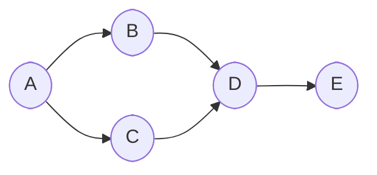
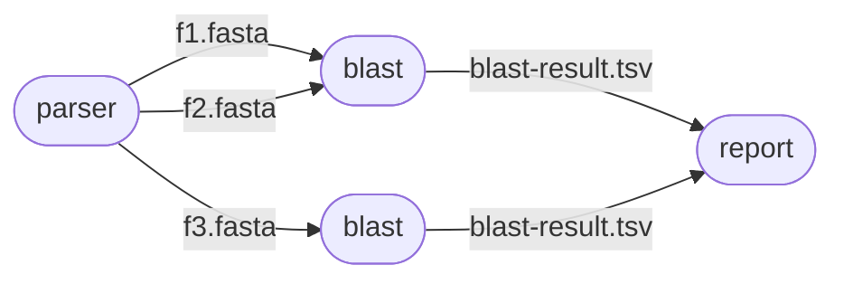

# DryPipe

## A Python DSL for bioinformatics pipelines


## Getting Started

#### 1 Install dry-pipe in your virtualenv

```shell
    pyton3.8 -m venv your_venv 
    source your_venv/bin/activate
    pip install dry-pipe
```

#### 2 Write your  pipeline

```python

    from dry_pipe import DryPipe
    
    def my_pipeline_task_generator(dsl):
        yield dsl.task(key="task1") 
            .consumes(x=dsl.val(123)) 
            .produces(result=dsl.file("f.txt"))
            .calls("""
                #!/usr/bin/env bash                
                echo $x > $result
            """)
        
        yield dsl.task(key="task2") 
            .consumes(a=dsl.val(456)) 
            .produces(z=dsl.var(int))
            .calls("""
                #!/usr/bin/env bash
                export z=432                
            """)
    def my_pipeline():
        return DryPipe.create_pipeline(my_pipeline_task_generator)
```

#### 3 Run it
(assuming the above code is in module my_module.py)
```shell
    drypipe run --pipeline='my_module:my_pipeline'
```


# The DAG

DAGs (directed acyclic graph) are a very convenient mathematical abstraction to represent things such as pipelines.



The following DAG represents the execution of a pipeline. Each node represents the execution of a program, and arrows represent the producer / consumer relationship between the programs.




A DryPipe pipeline definition, consists of a python generator function (*) that yields a DAG 


```python

from dry_pipe import DryPipe

def conservation_pipeline_generator(dsl):        
    yield dsl.task(key="blast1") \
        .consumes(a=dsl.file("chimp")) \
        .produces(result=dsl.file("f.txt")) \
        .calls("""
            #!/usr/bin/env bash                
            blastp $a $b
        """)
    
def conservation_pipeline():
    return DryPipe.create_pipeline(conservation_pipeline_generator)
```

 
### Pipeline vs Pipeline Instance

